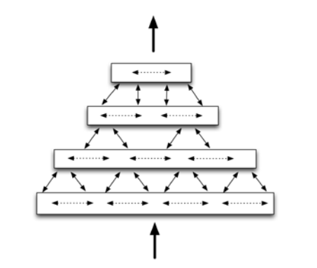

# Honors Research on Cortical Learning Algorithms

A repository for files related to my Honors Research Thesis at Westminster College.

  <figure>
    
  </figure>

## Table of Contents
* [Thesis](#thesis)
* [Implementations](#impl)
* [Time Series Analysis](#timeseries)
* [Introduction to Hierarchical Temporal Memory](#introHTM)
* [Particle Swarm Optimization](#pso)
* [Sources](#sources)

## <a id="thesis">Thesis</a>

We've been playing with a few ideas, but have to find something achievable within our time frame.

Right now we are working on trying to categorize the predictive power of Hierarchical Temporal Networks using ARIMA models as a function of some of their parameters (i.e. cells per column, number of layers, etc.). [Check out the code!](src)

***

## <a id="imp">Implementations of Interest</a>

* [HTMCLA (C++)](https://github.com/MichaelFerrier/HTMCLA)
  * [Demo: C++ implementation of Numenta's HTM Cortical Learning Algorithm](https://www.youtube.com/watch?v=IXg_XIm5kqk)
* [Clortex](https://github.com/htm-community/clortex)
* [Comportex](https://github.com/htm-community/comportex)
* [HTM.java](https://github.com/numenta/htm.java)
* [NuPIC](https://github.com/numenta/nupic)

***

## <a id="timeseries">Time Series Analysis</a>

Slides from PhDEconomics:
* [What is a Time Series](http://www.phdeconomics.sssup.it/documents/Lesson1.pdf)
* [What is a Time Series Model](http://www.phdeconomics.sssup.it/documents/Lesson2.pdf)
* [ARMA Models](http://www.phdeconomics.sssup.it/documents/Lesson9.pdf)

[Introduction to ARMA Models from Wharton](http://www-stat.wharton.upenn.edu/~stine/stat910/lectures/08_intro_arma.pdf)

[ARMA Lection Notes from OSU](https://www.asc.ohio-state.edu/de-jong.8/note2.pdf)

***

## <a id="introHTM">Introduction to Hierarchical Temporal Memory</a>

**Numenta Research: Key Discoveries in Understanding How the Brain Works**

This video gives an excellent overview of the neocortex and gives an intuitive understanding of the theory.

**Numenta's HTM School with Matt Taylor**

HTM School provides a multipart overview of the various components of Hierarchical Temporal Memory.

***

## <a id="pso">Particle Swarm Optimization</a>

**Particle Swarm Optimization (PSO) Visualized**

Particle swarm optimization (PSO) is a population based stochastic optimization technique developed by Dr. Eberhart and Dr. Kennedy in 1995, inspired by social behavior of bird flocking or fish schooling.

PSO shares many similarities with evolutionary computation techniques such as Genetic Algorithms (GA). The system is initialized with a population of random solutions and searches for optima by updating generations. However, unlike GA, PSO has no evolution operators such as crossover and mutation. In PSO, the potential solutions, called particles, fly through the problem space by following the current optimum particles.

Each particle keeps track of its coordinates in the problem space which are associated with the best solution (fitness) it has achieved so far. (The fitness value is also stored.) This value is called pbest. Another "best" value that is tracked by the particle swarm optimizer is the best value, obtained so far by any particle in the neighbors of the particle. This location is called lbest. when a particle takes all the population as its topological neighbors, the best value is a global best and is called gbest.

The particle swarm optimization concept consists of, at each time step, changing the velocity of (accelerating) each particle toward its pbest and lbest locations (local version of PSO). Acceleration is weighted by a random term, with separate random numbers being generated for acceleration toward pbest and lbest locations.

In past several years, PSO has been successfully applied in many research and application areas. It is demonstrated that PSO gets better results in a faster, cheaper way compared with other methods.

Another reason that PSO is attractive is that there are few parameters to adjust. One version, with slight variations, works well in a wide variety of applications. Particle swarm optimization has been used for approaches that can be used across a wide range of applications, as well as for specific applications focused on a specific requirement.

[Read more on swarming](http://www.swarmintelligence.org/index.php)

## <a id="sources">Sources</a>

A great resource to learn about Cortical Learning Algorithms is of course, Numenta. They strongly advocate for open science and post their [research papers](https://numenta.com/neuroscience-research/research-publications/papers/) as well as [conference posters](https://numenta.com/neuroscience-research/research-publications/posters/) online at their website. Numenta also has a [YouTube channel](https://www.youtube.com/channel/UCLNQzXAfcH8H8cMmG0sfV6g) with lots of helpful resources and for a more gentle introduction, Numenta's Matt Taylor has an excellent [YouTube channel called HTM School](https://www.youtube.com/user/OfficialNumenta).

For a comprehensive list of papers and presentations, check the **References** section of my Honors Research draft, but here is a good list to get you started:

* [Advanced NuPIC Programming](http://cfile23.uf.tistory.com/attach/121B8F374F14E16A179668)
* [Biological and Machine Intelligence](https://numenta.com/resources/biological-and-machine-intelligence/)
* [Encoding Data for HTM Systems](https://arxiv.org/abs/1602.05925)
* [Enhancement of Classifiers in HTM-CLA Using Similarity Evaluation Methods](https://www.sciencedirect.com/science/article/pii/S1877050915023881)
* [Evaluation of Hierarchical Temporal Memory in algorithmic trading](http://liu.diva-portal.org/smash/record.jsf?pid=diva2%3A302092&dswid=-7957)
* [A Framework for Intelligence and Cortical Function Based on Grid Cells in the Neocortex](https://www.biorxiv.org/content/early/2018/10/13/442418)
* [Getting Predictions out of HTM (CLA Classifiers)](https://www.youtube.com/watch?v=QZBtaP_gcn0)
* [Hierarchical Temporal Memory including HTM Cortical Learning Algorithms](https://numenta.org/resources/HTM_CorticalLearningAlgorithms.pdf)
* [Have We Missed Half of What the Neocortex Does? A New Predictive Framework Based on Cortical Grid Cells](https://www.slideshare.net/numenta/have-we-missed-half-of-what-the-neocortex-does-a-new-predictive-framework-based-on-cortical-grid-cells)
* [HTM School: Scalar Encoding](https://www.youtube.com/watch?v=V3Yqtpytif0)
* [Intelligent Predictions: an Empirical Study of the Cortical Learning Algorithm](https://www.semanticscholar.org/paper/Intelligent-Predictions-%3A-an-empirical-study-of-the-Galetzka/585944db4d18d35c01816b663ef4736f8a7061ee)
* [Locations in the Neocortex: A Theory of Sensorimotor Object Recognition Using Cortical Grid Cells](https://www.biorxiv.org/content/early/2018/10/05/436352)
* [A Mathematical Formalization of Hierarchical Temporal Memory’s Spatial Pooler](https://arxiv.org/abs/1601.06116)
* [Principles of Hierarchical Temporal Memory (HTM): Foundations of Machine Intelligence](https://www.youtube.com/watch?v=6ufPpZDmPKA)
* [Properties of Sparse Distributed Representations and their Application to Hierarchical Temporal Memory](https://arxiv.org/abs/1503.07469)
* [Quantum Computation via Sparse Distributed Representation](https://arxiv.org/pdf/1707.05660.pdf)
* [Random Distributed Scalar Encoder](http://fergalbyrne.github.io/rdse.html)
* [Real Machine Intelligence with Clortex and NuPIC](https://leanpub.com/realsmartmachines/read)
* [Semantic Folding: Theory and its Application in Semantic Fingerprinting](https://arxiv.org/abs/1511.08855)
* [SDR Classifier](http://hopding.com/sdr-classifier#title)
* [A Theory of How Columns in the Neocortex Enable Learning the Structure of the World](https://www.frontiersin.org/articles/10.3389/fncir.2017.00081/full)
* [Towards a Mathematical Theory of Cortical Micro-circuits](https://journals.plos.org/ploscompbiol/article?id=10.1371/journal.pcbi.1000532)
